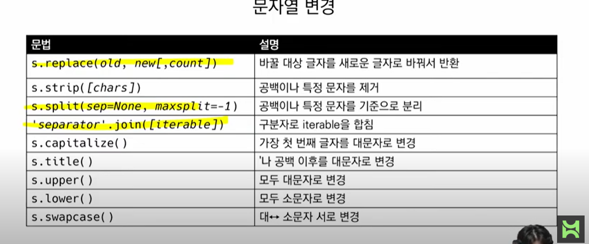
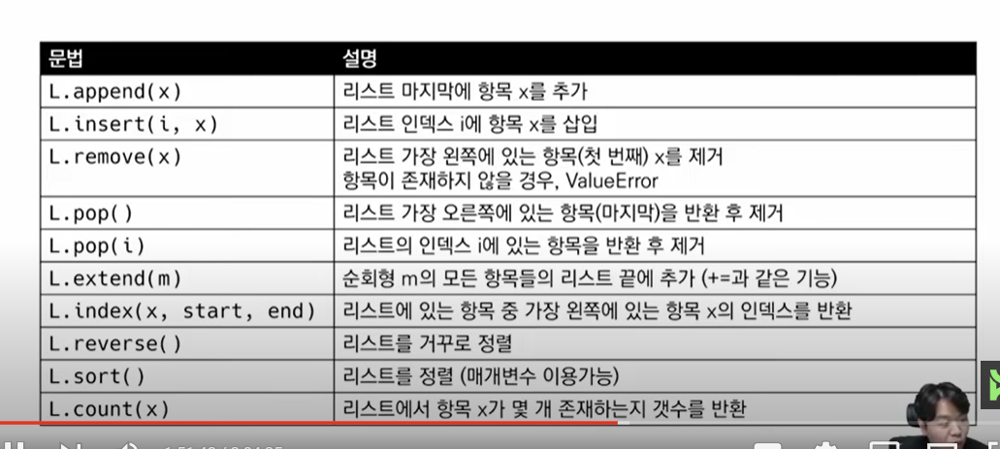

## 2일차

#### 제어문(Control )

- 조건문 : 참 거짓을 판단할 수 있는 조건식과 함께 사용

```python
if < expression >:
    Code block#참일 때 실행
else < expression >:
      Code block#거짓일 때 실행
```

- 복수 조건문 : 복수의 조건식을 활용할 경우

```python
if < expression >:
    Code block
elif < expression >:
    Code block
elif < expression >:
    Code block
else:
    Code block	
```

- 조건 표현식 : 일반적으로 조건에 따라 값을 정할 때 활용

```python
<true인 경우 값>if <expression> else <false인 경우 값>
```

#### 반복문 : 특정 조건을 도달할 때까지, 계속 반복되는 일련의 문장

- while 문 : 종료조건에 해당하는 코드를 통해 반복문을 종료시켜야함

```python
while < expression >:
    Code block #참일 때 계속 반복실행,
Code block #거짓일 때 실행 후 반복 종료
```

- for 문 : 반복가능한 객체(시퀀스포함)를 모두 순회하면 종료(별도의 종료조건이 필요 없음)

```python
for 변수 in 객체
    Code block#변수에 객체를 하나씩 순회, 대입하며 코드를 반복실행
```

- 반복문 제어
  - break : 반복문을 종료
  - continue : continue 이후의 코드 블록은 수행하지 않고, 다음 반복을 수행
  - for-else : 끝까지 반복문을 실행한 이후에 else문 실행

## 3일차

#### 함수

함수를 사용하는 이유

- Decomposition : 기능을 분해하고 재사용이 가능함
- Abstraction : 복잡한 내용을 숨기고, 기능에 집중하여 사용할 수 있음

## 4일차

매서드

- 문자열

  

- 리스트


