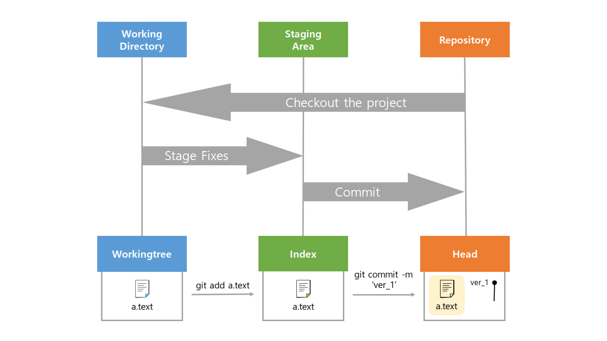

# 커밋을 위한 Git Bash 명령어📝

  

## 디렉토리(폴더) 관리 명령어

- `$ pwd`(print working directoty) : 현재 디렉토리 출력

- `$ cd ~`(change directory) : 디렉토리 이동

- `$ ls`(list) : 목록

- `$ mkdir ~`(make directory) : 디렉토리 생성

- `$ touch ~ ` : 파일의 날짜와 시간을 수정(0바이트 빈파일 생성)

- `$ rm ~` : 파일 삭제 / `$ rm -r ~ ` : 폴더 삭제

  > . : 현재 디렉토리, .. : 상위 디렉토리

  

## 사용자 정보 설정 명령어

- 사용자 정보(commit author) 설정

  - `$ git config --global user.name <username>`

  - `$ git config --global user.email <useremail>`
- 설정 확인
  - `$ git config --global -l`

  

## 커밋을 위한 명령어

- `$ git init` : 특정 폴더에 git 저장소(repos를 생성

- `$ git add ~ ` : 파일의 변경 사항을 staging area 에 추가

- `$ git commit -m '<커밋메세지>'` : staged 상태의 파일을 로컬 저장소에 버전으로 기록

- `$ git log`: 현재 저장소에 기록된 커밋을 조회

- `$ git status` : git 저장소에 있는 파일의 상태를 확인

