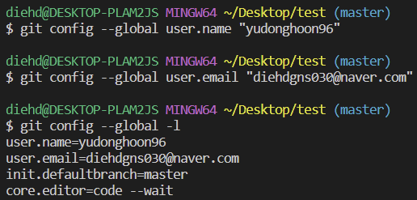
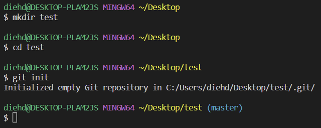
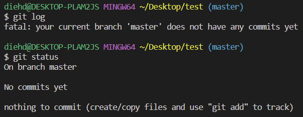
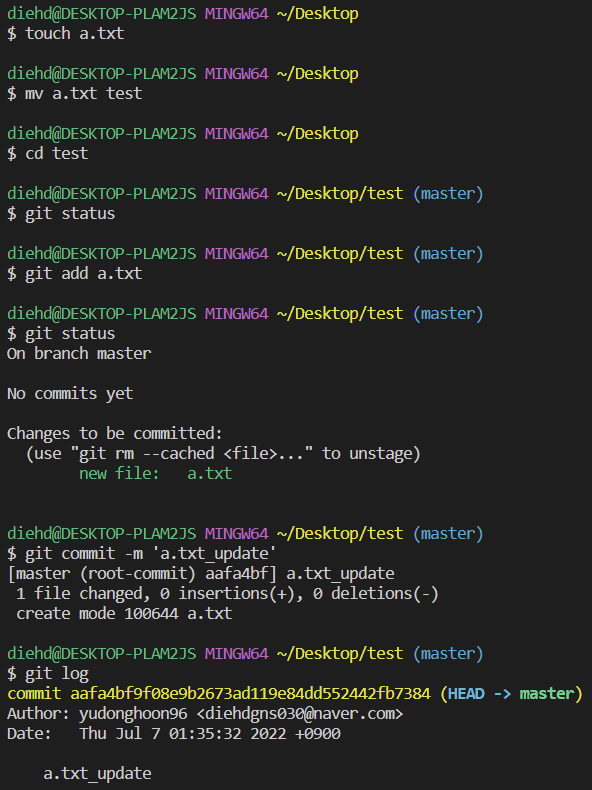
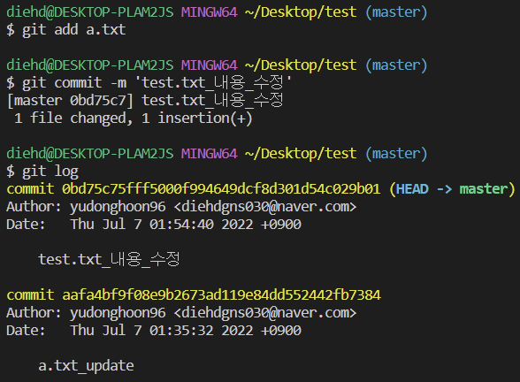

## Git 실습 1. 저장소 만들고 변경사항 커밋 해보기💻

<br/>

0. **사용자 정보(commit author) 설정하기**

1. **바탕화면에 test 폴더를 만들고 git 저장소 만들기**

2. **a.txt 파일 넣고 커밋 하기**

3. **a.txt 파일 수정하고 커밋 하기**

   > 각 단계별로 status와 log 확인	

<br/>

___

<br/>

0. **사용자 정보(commit author) 설정하기**

```bash
   $ git config --global user.name` "yudonghoon96"
   # Github에서 설정한 username으로 설정
   $ git config --global user.email` "diehdgns030@naver.com"
   # Github에서 설정한 email으로 설정
   $ git config --global -l
   user.name=yudonghoon96
   user.email=diehdgns030@naver.com
   init.defaultbranch=master
   core.editor=code --wait
   # 등록 된 정보 확인
```



<br/><br/>

1. **바탕화면에 test 폴더를 만들고 git 저장소 만들기**

```bash
   $ mkdir test
   # test 디렉토리(폴더)를 생성
   $ cd test
   # 바탕화면에서 test 폴더로 디렉토리 이동
   $ git init
   Initialized empty Git repository in C:/Users/diehd/Desktop/test/.git/
   # git 저장소 생성
```



<br/>

```bash
   $ git log
   fatal: your current branch 'master' does not have any commits yet
   # 버전확인: 현재 저장소에 기록된 커밋이 없음
   $ git status
   On branch master
 
   No commits yet
 
   nothing to commit (create/copy files and use "git add" to track)
   # 상태확인: 저장소에 있는 파일의 변경 내용이 없음
```



<br/><br/>

2. **a.txt 파일 넣고 커밋하기**

```bash
   $ touch a.txt
   # a.txt 파일 생성
   $ mv a.txt test
   # 바탕화면에 있는 a.txt 파일을 test 폴더로 이동
   $ cd test
   # test 폴더로 디렉토리 이동
   $ git add a.txt
   # woring directory 상의 변경 내용을 staging area에 추가
   $ git status
   On branch master
   
   No commits yet
   
   Changes to be committed:
     (use "git rm --cached <file>..." to unstage)
           new file:   a.txt
   # 상태확인: 저장소에 있는 파일의 변경 내용이 있으나 아직 커밋되지 않음
   $ git commit -m 'a.txt_update'
   [master (root-commit) aafa4bf] a.txt_update
    1 file changed, 0 insertions(+), 0 deletions(-)
    create mode 100644 a.txt
   # staged 상태의 파일을 커밋을 통해 버전으로 기록
   $ git log
   commit aafa4bf9f08e9b2673ad119e84dd552442fb7384 (HEAD -> master)
   Author: yudonghoon96 <diehdgns030@naver.com>
   Date:   Thu Jul 7 01:35:32 2022 +0900
   
       a.txt_update
   # 버전확인: 사전 설정해놓은 사용자 정보에 맞게 커밋 됨
```



<br/><br/>

3. **a.txt 파일 수정하고 커밋하기**

```bash
   a.txt 파일 수정 후 저장
   $ git add a.txt
   # woring directory 상의 변경 내용을 staging area에 추가
   $ git commit -m 'test.txt_내용_수정'
   [master 0bd75c7] test.txt_내용_수정
    1 file changed, 1 insertion(+)
    # staged 상태의 파일의 변경 내용을 커밋을 통해 새로운 버전으로 기록
   $ git log
   commit 0bd75c75fff5000f994649dcf8d301d54c029b01 (HEAD -> master)
   Author: yudonghoon96 <diehdgns030@naver.com>
   Date:   Thu Jul 7 01:54:40 2022 +0900

       test.txt_내용_수정

   commit aafa4bf9f08e9b2673ad119e84dd552442fb7384
   Author: yudonghoon96 <diehdgns030@naver.com>
   Date:   Thu Jul 7 01:35:32 2022 +0900

       a.txt_update
   # 버전확인: 파일의 변경 내용이 새로운 버전으로 커밋 됨
```

