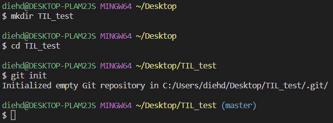
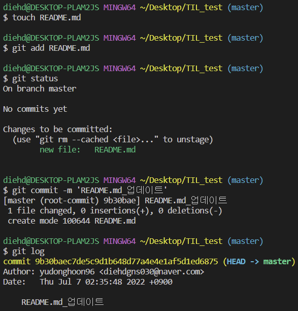
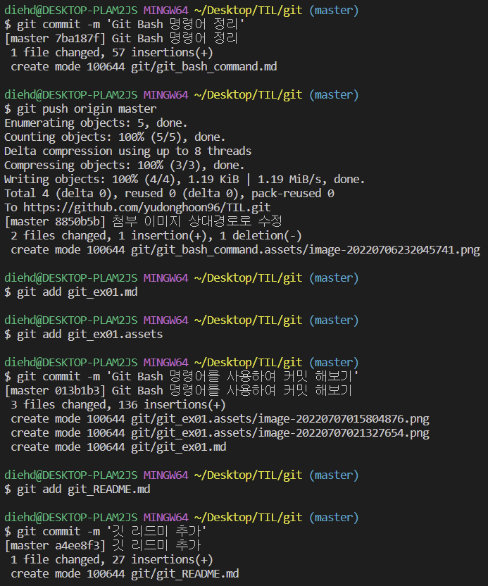

## 💻Git 실습 2. TIL 프로젝트 - 학습한 내용 커밋 해보기

<br/>

1. **바탕화면에 TIL폴더를 만들고 git 저장소 만들기**

2. **README.md 파일 만들고 커밋 하기**

3. **학습한 내용 정리하고 커밋 하기**

   > 마크다운 파일별로 각각 커밋을 진행 해보기

<br/>

___

<br/>

1. **바탕화면에 TIL폴더를 만들고 git 저장소 만들기**

```bash
   diehd@DESKTOP-PLAM2JS MINGW64 ~/Desktop
   $ mkdir TIL_test
   # TIL_test 폴더(디렉토리) 생성
   $ cd TIL_test
   # TIL_test 폴더로 디렉토리 이동
   $ git init
   Initialized empty Git repository in C:/Users/diehd/Desktop/TIL_test/.git/
   # git 저장소 생성
   diehd@DESKTOP-PLAM2JS MINGW64 ~/Desktop/TIL_test (master)
```



<br/><br/>

2. **README.md 파일 만들고 커밋 하기**

```bash
   diehd@DESKTOP-PLAM2JS MINGW64 ~/Desktop/TIL_test (master)
   $ touch README.md
   # README.md 파일 생성
   $ git add README.md
   # woring directory 상의 변경 내용을 staging area에 추가
   $ git status
   On branch master

   No commits yet

   Changes to be committed:
     (use "git rm --cached <file>..." to unstage)
           new file:   README.md
   # 상태확인: 저장소에 있는 파일의 변경 내용이 있으나 아직 커밋되지 않음
   $ git commit -m 'README.md_업데이트'
   [master (root-commit) 9b30bae] README.md_업데이트
    1 file changed, 0 insertions(+), 0 deletions(-)
    create mode 100644 README.md
   # staged 상태의 파일을 커밋을 통해 버전으로 기록
   diehd@DESKTOP-PLAM2JS MINGW64 ~/Desktop/TIL_test (master)
   $ git log
   commit 9b30baec7de5c9d1b648d77a4e4e1af5d1ed6875 (HEAD -> master)
   Author: yudonghoon96 <diehdgns030@naver.com>
   Date:   Thu Jul 7 02:35:48 2022 +0900

    README.md_업데이트
   # 버전확인: 사전 설정해놓은 사용자 정보에 맞게 커밋 됨
```



<br/><br/>

3. **학습한 내용 정리하고 커밋 하기**


