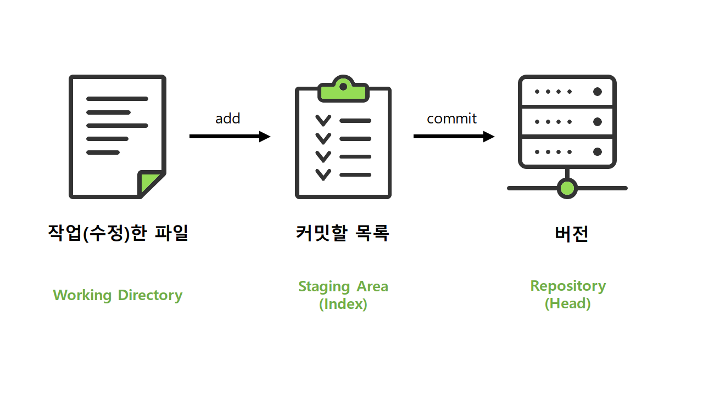
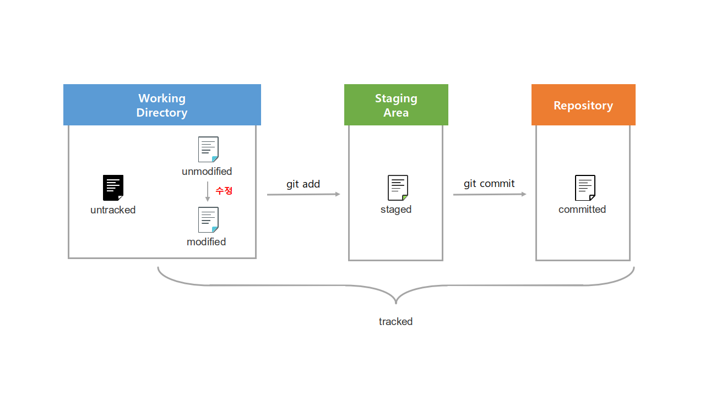

# Git의 3가지 작업 영역과 파일의 다양한 상태

  

### 학습 목표

- Git의 3가지 작업 영역과 기본 흐름 이해하고, 이러한 작업 영역들이 왜 존재하는지 설명할 수 있다.

- Git으로 버전관리되는 파일의 다양한 상태를 이해하고,  순서에 따라 파일들이 어떻게 이동하고 기록되는지 설명할 수 있다.

  

## Git의 기본 흐름과 3가지 작업 영역

 **Git은 Working Directory, Staging Area, Repository 3가지 작업 영역으로 파일들을 관리한다.**

- Woring Directory(작업 영역) : 파일을 생성하고 작업(수정)을 하는 프로젝트 영역

- Staging Area(인덱스) :  작업한(수정된) 파일들 중 버전으로 관리(커밋) 하기 위해 add된 파일들이 위치하는 영역

- Repository(헤드) : commit되어 버전을 관리하는 파일들이 위치하는 영역

 

>**Q. Staging area는 왜 필요할까?**
>
> Staging area는 파일이 커밋 되기 이전에 대기 상태로 위치하게 되는 공간이다. 불필요한 과정이라고 생각 할 수도 있지만, 이는 버전을 보다 atomic 하게 관리할 수 있게 해주며, Git을 더욱 생산적인 도구로 만들어준다. 일부분만 커밋 할 때, 충돌을 해결할 때, 커밋을 다시 할 때, 등 다양한 상황에서 유용하게 활용된다.

  

## Git에서 관리하는 파일의 다양한 상태

**Git을 통해서 버전 관리되는 파일들은 다양한 상태를 가지게 된다.**

- 추적 관리 여부에 따라서 untracked 와 tracked 상태로 나눌 수 있다.

  - untracked :  git으로 추적 관리하기 이전의 상태
  
  
    - tracked :  git으로 추적 관리하고 있는 상태
  

- git으로 추적 관리되는 파일은 변경(수정) 여부에 따라서 modified와 unmodifed 상태로 나눌 수 있다.

  - unmodified : 변경 사항이 없는 상태
  
  
    - modified : 변경 사항이 있지만 아직 커밋하지 않은 상태
  

- add된 파일은 커밋 여부에 따라서 staged 와 committed 상태로 나눌 수 있다.

  - staged : 파일을 커밋 하기 위해 Staging Area에 add한 상태
  
  
    - committed : 커밋되어 파일의 버전이 로컬 저장소에 기록된 상태
  

  

### 참고문서

[Git Documentation Book](https://git-scm.com/book/ko/v2)

