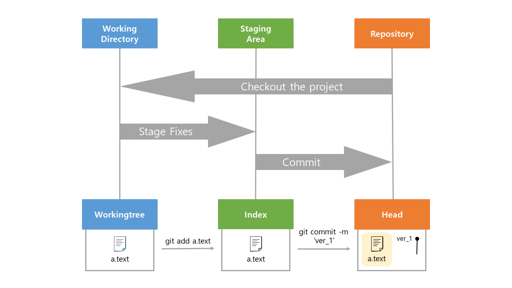

# Git의 3가지 작업 영역과 파일의 다양한 상태

  

## Git의 기본 흐름과 3가지 작업 영역

 Git은 **Working Directory**, **Staging Area**, **Repository** 3가지 작업 영역으로 파일들을 관리한다.

- Woring Directory(작업 영역) : 파일을 생성하고 작업(수정)을 하는 프로젝트 영역

- Staging Area(인덱스) :  작업한(수정된) 파일들 중 버전으로 관리(커밋) 하기 위해 add된 파일들이 위치하는 영역

- Repository(헤드) : commit되어 버전을 관리하는 파일들이 위치하는 영역

 

>**Q. Staging area는 왜 필요할까?**
>
> Staging area는 파일이 커밋 되기 이전에 대기 상태로 위치하게 되는 공간이다. 불필요한 과정이라고 생각 할 수도 있지만, 이는 버전을 보다 atomic 하게 관리할 수 있게 해주며, Git을 더욱 생산적인 도구로 만들어준다. 일부분만 커밋 할 때, 충돌을 해결할 때, 커밋을 다시 할 때, 등 다양한 상황에서 유용하게 활용된다.

  

## Git에서 관리하는 파일의 다양한 상태

Git을 통해서 버전 관리되는 파일들은 다양한 상태를 가지게 된다.

- 추적 관리 여부에 따라서 untracked 와 tracked 상태로 나눌 수 있다.

  - untracked :  git으로 추적 관리하기 이전의 상태

  - tracked :  git으로 추적 관리하고 있는 상태

- 파일의 변경(수정) 여부에 따라서 modified와 unmodifed 상태로 나눌 수 있다.

  - unmodified : 관리 대상으로 add 되었지만 아직 수정하지 않은 상태

  - modified : 수정한 파일을 아직 로컬 저장소에 커밋하지 않은 상태

- 커밋 여부에 따라서 staged 와 committed 상태로 나눌 수 있다.

  - staged : 수정한 파일을 커밋 하기 위해 Staging Area에 내역을 add한 상태

  - committed : 커밋되어 데이터가 로컬 저장소에 안전하게 저장된 상태

  

## 커밋을 위한 명령어 정리

- **`$ git init`** : 특정 폴더에 git 저장소(repository)를 생성

  .git 폴더가 생성되며, git bash에서는 (master)라는 표기를 확인 가능

- **`$ git add <file>`** : working directory 상의 변경 사항을 staging area(index) 에 추가

- **`$ git commit -m '<커밋메세지>'`** : staged 상태의 파일을 커밋을 통해 버전으로 기록

  > 커밋 메세지는 변경 사항을 나타낼 수 있도록 명확하게 작성 필요

- **`$ git log`**

  현재 저장소에 기록된 커밋을 조회

- **`$ git status`** 

  git 저장소에 있는 파일의 상태를 확인

    

### **결론**

Git의 3가지 영역을 이해하고, 이러한 영역이 왜 존재하는지 알고 파일을 관리해야 한다.

각 영역은 사용처가 있으며, 순서에 따라 파일들이 이동하고 기록된다.(Life Cycle)

  

## 참고문서

[Git Documentation Book](https://git-scm.com/book/ko/v2)