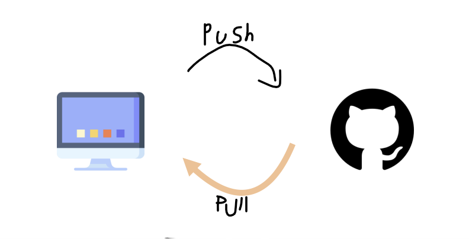

# GitHub와 원격저장소 활용🗃️

 

 

## 개요 

- #### GitHub란?

   Git이 분산 버전 관리 시스템이라면 GitHub는 이러한 Git을 사용하는 프로젝트를 지원하는 웹호스팅 서비스(**원격 저장소**)다.

  > GitHub를 사용하여 버전 관리와 협업을 더 효율적으로 할 수 있다.

  

## 원격 저장소 기본 흐름

## 원격저장소 활용 기본 명령어

- `$ git clone <url>`

  로컬 저장소가 없는데 원격저장소의 버전들을 가져오고 싶을 때

  원격저장소 복제

- `$ git remote -v`

  원격 저장소의 정보를 확인

- `$ git remote add <원격저장소> <url>`

  원격 저장소(Repository)를 로컬 저장소에 추가

- `$ git remote rm <원격저장소>`

  원격저장소 삭제

- `$ git push <원격저장소> <브랜치>`

  원격 저장소로 로컬 저장소의 변경 사항을 올림

- `$ git pull <원격저장소> <브랜치>`

  원격 저장소로부터 변경된 내역을 받아와서 이력을 병합

### .gitignore

- 버전 관리를 별도로 할 필요가 없는 파일 및 폴더를 기록하여 git status 목록에서 제외할 수 있다.

> 프로젝트를 시작하기 전에 미리 설정해야 한다. (이미 커밋된 파일은 삭제해야 제외가 가능하기 때문)

## 실습

- 원격 저장소를 만들고 push & pull 해보기
- .gitignore 적용 해보기
